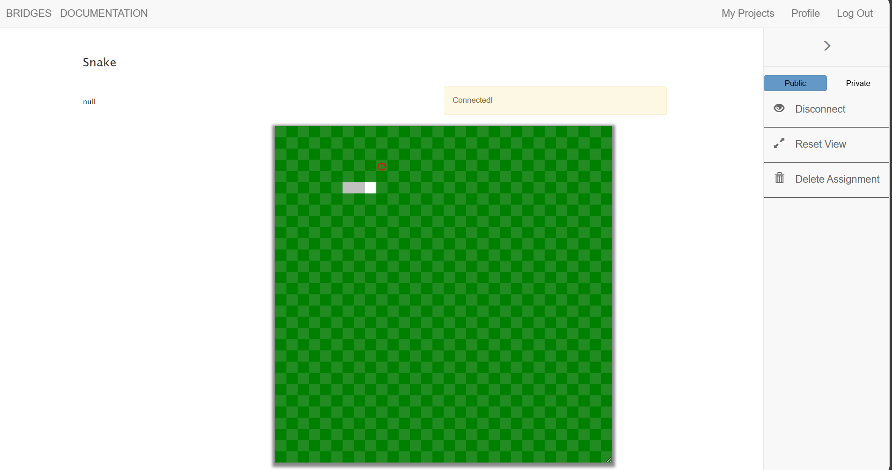

# 🐍 Snake Game using BRIDGES API (Java)

This is a simple **Snake Game** implementation using the [BRIDGES](http://bridgesuncc.github.io/) visualization API in Java. The game demonstrates basic game loop structure, keyboard input handling, collision detection, and dynamic data structures like linked lists to simulate the snake's movement and growth.



---

## 🎮 Features

- Snake moves continuously in the current direction
- Apple is randomly planted; the snake grows upon eating it
- Snake wraps around the screen edges
- Collision detection (game over if snake eats itself)
- Linked list used for snake body representation
- Fully visualized using BRIDGES with colors and symbols

---

## 📁 Project Structure

```text
.
├── SnakeGame/
│   ├── Snake.java        # Main game class
│   └── Block.java        # Block class used to create linked list snake
├── Snake_game_.png       # Screenshot of the game
└── README.md             # This file
